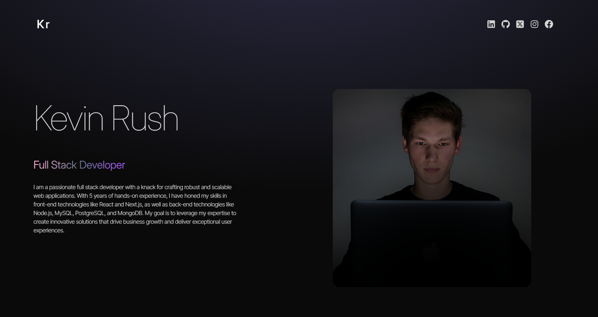
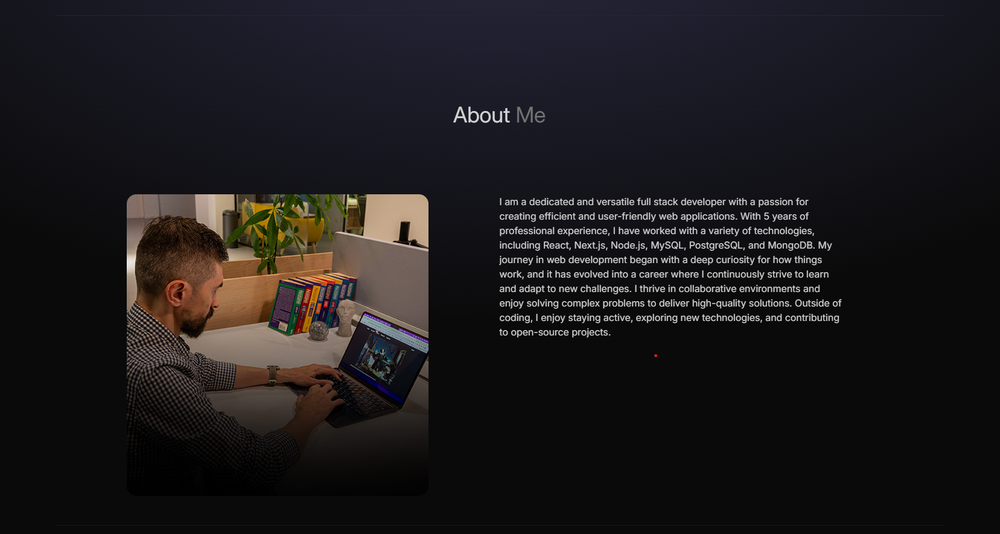
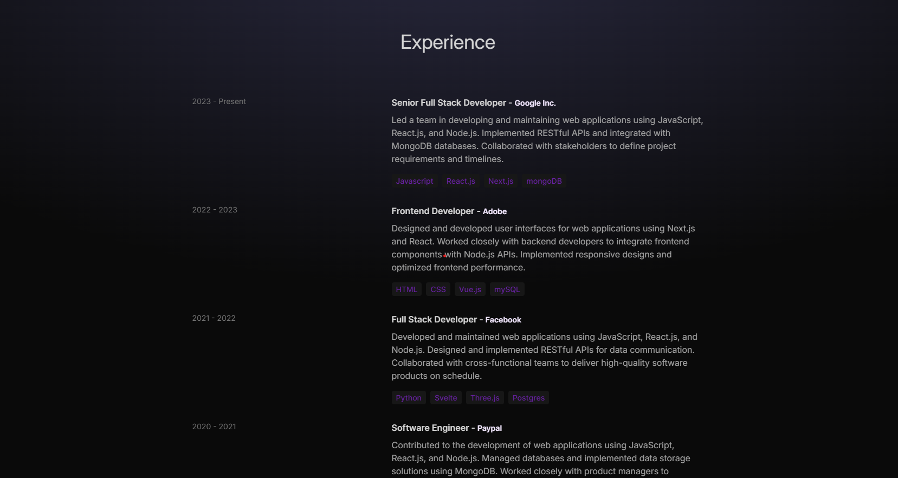
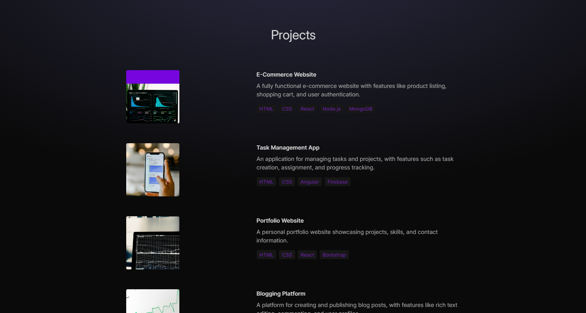
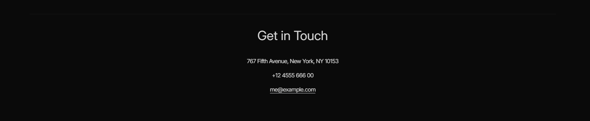

# Hrushi Joshi Portfolio Website 🌟

Excited to share my sleek and responsive portfolio website! 🚀

This project was a hands-on way to learn **TailwindCSS**, **Framer Motion**, and **TypeScript**, inspired by the incredible [compiletab tutorial](https://www.youtube.com/watch?v=_63mEm3AMSY&t=29s). Their stunning design choices, like gradient backgrounds and typography, served as the perfect foundation for creating a captivating website.

Tutorial link: https://www.youtube.com/watch?v=_63mEm3AMSY&t=29s

## 🌐 Deployed Website

Check out the live version of the website here:  
🔗 [https://kevinrushportfoliowebsite.netlify.app](https://kevinrushportfoliowebsite.netlify.app)

## 🎥 Demo Video

Here’s a quick walkthrough of the website in action:


---

## 🚀 Features

- **Responsive Design:** Fully optimized for desktop and mobile views.
- **Dynamic Animations:** Smooth transitions and interactions using **Framer Motion**.
- **Scalable Codebase:** Built with **TypeScript** for type safety and maintainability.
- **TailwindCSS Styling:** Fast, efficient, and modern styling with Tailwind's utility-first framework.

---

## 📸 Screenshots

### Hero Section



### About Section



### Technologies Section


### Experience Section



### Projects Section



### Contact Section



---

## 🛠️ Technologies Used

- **React**
- **TypeScript**
- **TailwindCSS**
- **Framer Motion**

---

## 📂 How to Run Locally

1. Clone this repository:

   ```bash
   git clone https://github.com/HrushikeshJoshi187/Kevin_Rush_Portfolio_Website.git
   ```

2. Navigate to the project folder:

   ```bash
   cd Hrushi_Joshi_Portfolio_Website_001
   ```

3. Install dependencies:

   ```bash
   npm install
   ```

4. Start the development server:

   ```bash
   npm run dev
   ```

Open your browser and navigate to http://localhost:5173 (default Vite localhost)

## 📁 Explore the Project

🔗 GitHub Repository: https://github.com/HrushikeshJoshi187/Kevin_Rush_Portfolio_Website

🎉 Acknowledgments
A huge shoutout to compiletab for their fantastic tutorial. If you're looking to learn TailwindCSS and Framer Motion, this is the guide to follow!

Feel free to ⭐️ this repository if you found it inspiring or helpful. I'd love to hear your thoughts—drop a comment or open an issue! 😊

Built with ❤️ by Hrushi Joshi
